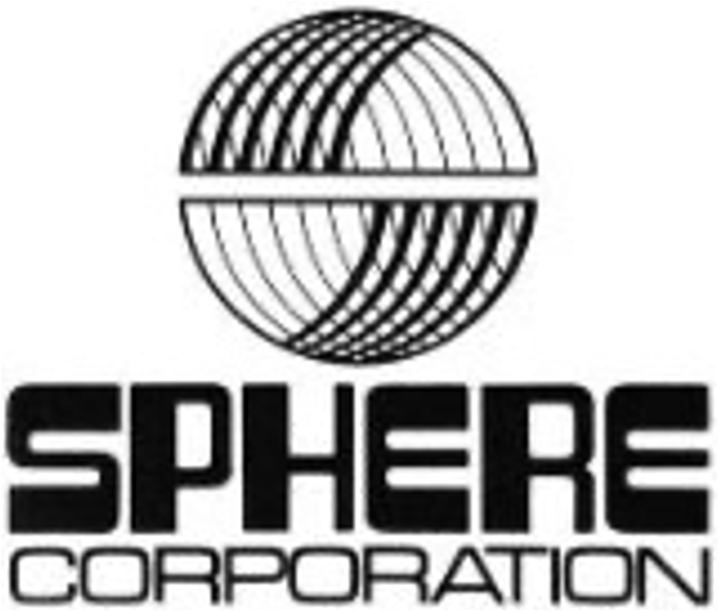

<!-- PROJECT LOGO -->
 

  

    A 21st Century recreation of the Sphere-1 CPU/2 Module
      

<!-- ABOUT THE PROJECT -->
## About The Project

My journey into the Sphere started in March 2023, when I came across the interesting computer "Sphere 1" produced and marketed from Bountiful, Utah, beginning around 1975.

I found this reference on a [Hackaday page](https://hackaday.com/2023/03/11/a-love-letter-to-the-sphere-computer/), which led me to Ben Zotto's fantastic resource "http://sphere.computer”

With an interest in retro computing, but a very elementary electronics knowledge, I decided that I had to build one, as no-one had attempted to re-create one from scratch since the original build days.

The main issue is that the documentation is sparse, with the computers even sparser!

This is the story of how I got on, my trials and tribulations and (hopefully) in time, the results of my labours.

<!-- INSTRUCTIONS -->

## Getting started

- Ensure that you have a git client installed [for your platform](https://git-scm.com)
- Ensure that you have the gif lfs extension installed [for your platform](https://git-lfs.com)
- Clone the main Sphere-1 repository using
  `git clone --recurse-submodules https://github.com/Sphere-Corporation/Sphere-1.git`

- If you want to examine or modify the PCB layouts, you will need to install [KiCAD](kicad.org).
  

<!-- CONTRIBUTING -->

## Contributing

Contributions are what make the open source community such an amazing place to learn, inspire, and create. Any contributions you make are **greatly appreciated**.

If you have a suggestion or a resource that would help me, or perhaps you see something I've got wrong, please create an Issue. 

<!-- LICENSE 
## License

Distributed under the MIT License. See `LICENSE.txt` for more information.
-->

<!-- CONTACT -->
## Contact

eMail [Andrew Shapton](mailto:alshapton@gmail.com)

<!-- ACKNOWLEDGMENTS -->
## Acknowledgments

I have to give my heartfelt thanks to Ben Zotto, who has been a sounding board for me throughout this project, answering my emails, and checking his Sphere-1 CPU/2 board to answer questions, and offering thoughts as to why things “were like they were” ! Without him, I would never have got as far as I have.

<!-- MARKDOWN LINKS & IMAGES -->
<!-- https://www.markdownguide.org/basic-syntax/#reference-style-links -->

[sphere-corporation-logo]: sphere-corporation.png
